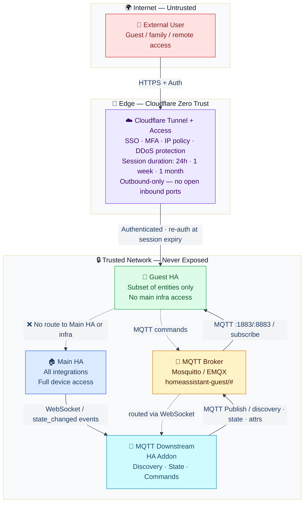

# MQTT Downstream — Architecture

> Isolate your main Home Assistant instance from external access by bridging entity state through a downstream MQTT broker and a hardened guest HA instance.



## Security boundaries

| Zone | Components | Exposed |
|---|---|---|
| 🔒 Trusted | Main HA, MQTT Downstream addon, MQTT broker, Guest HA | Never — internal network only |
| 🔐 Edge | Cloudflare Tunnel + Access | Outbound tunnel only — zero inbound firewall rules |
| 🌍 Internet | External users | See Guest HA UI only, behind Cloudflare auth |

## Data flow

| Flow | Protocol | Notes |
|---|---|---|
| Main HA → Addon | WebSocket | Internal — `state_changed` event stream |
| Addon → MQTT Broker | MQTT | Publishes discovery, state, and attribute sub-topics |
| Guest HA → MQTT Broker | MQTT `:1883` / `:8883` | Direct internal connection — not through the tunnel |
| Guest HA → Command | MQTT → Addon → WebSocket | Commands routed back to Main HA service calls |
| External User → Guest HA UI | HTTPS via Cloudflare Tunnel | SSO + MFA enforced at edge |
| External User → Main HA | ❌ Blocked | No route — not reachable from outside |

## Cloudflare Zero Trust — session duration

Cloudflare Access allows you to configure how long an authenticated session lasts before the user must re-authenticate. This is configurable per application in the Cloudflare Zero Trust dashboard under **Access → Applications → Session Duration**.

| Duration | Recommended for |
|---|---|
| `24 hours` | Highest security — re-auth daily |
| `1 week` | Balanced — good for regular family members |
| `1 month` | Convenience — low-friction for trusted users |
| `No expiry` | Not recommended — session persists indefinitely |

When a session expires, the user is redirected to your identity provider to re-authenticate before accessing Guest HA again. This ensures that revoked users (e.g. removed from your identity provider) lose access within the configured window.

## MQTT topic-level ACLs

Home Assistant's built-in MQTT integration only supports per-user credentials — it has no concept of per-topic access control. This means any user with valid credentials can subscribe to or publish on any topic, which is too broad for a guest/downstream setup.

Mosquitto and EMQX both support **Access Control Lists (ACLs)** that restrict exactly which topics each user can read or write. This adds a meaningful security boundary even within the trusted network.

**Example Mosquitto ACL config:**

```
# MQTT Downstream addon — can publish discovery and state, subscribe to commands
user mqtt_downstream
topic write homeassistant-guest/#
topic read  homeassistant-guest/#

# Guest HA — can only subscribe to state/discovery, publish commands
user guest_ha
topic read  homeassistant-guest/#
topic write homeassistant-guest/+/+/set
topic write homeassistant-guest/+/+/set_#
topic write homeassistant-guest/+/+/send_command
```

With this in place, Guest HA cannot publish arbitrary payloads to state or discovery topics — it can only send commands to the designated `set` and `send_command` topics. Even if Guest HA credentials were compromised, the attacker could not inject false states or overwrite discovery payloads.

HA's own MQTT integration does not expose this level of control, which is another reason to run a dedicated broker rather than relying solely on HA's internal one.

## Key security properties

- **No inbound ports** on the trusted network — Cloudflare Tunnel is outbound-only
- **Main HA is never exposed** — not reachable from the internet, even if Guest HA is compromised
- **MQTT is internal only** — Guest HA connects to the broker over the local network, not through the tunnel
- **MQTT ACLs enforced at broker level** — Guest HA credentials are restricted to command topics only; state and discovery topics are write-protected
- **Scope-limited entities** — Guest HA only sees the entities you explicitly configure via MQTT Downstream
- **Commands are mediated** — all commands from Guest HA pass through the addon before reaching Main HA
- **Time-limited access** — Cloudflare Zero Trust enforces session expiry, ensuring revoked users lose access automatically