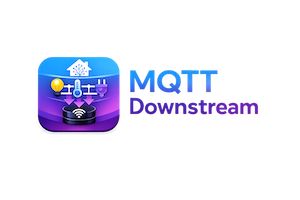

# MQTT Downstream



A Home Assistant addon that syncs entities to a downstream MQTT broker. Useful for exposing a subset of your HA entities to external systems, guest networks, or other HA instances via MQTT discovery.

## How it works

- Connects to HA via WebSocket and subscribes to all state changes
- Publishes MQTT discovery (`/config`), state (`/state`), and attribute sub-topics for each resolved entity
- Routes inbound MQTT commands back to HA services
- Re-runs discovery automatically on startup, when any config dropdown changes, or when an MQTT birth message is received
- When an entity is removed from the resolved list, its discovery payload is cleared from the broker
- New entities added to HA after startup are detected automatically and re-evaluated against configured globs
- Supports multiple instances — each instance operates independently with its own configuration

## Installation

1. Go to **Settings → Apps → Install app → ⋮ → Repositories**
2. Paste the repository URL: `https://github.com/maxandcheeses/ha-mqtt-downstream-addon`
3. Install **MQTT Downstream** from the Apps store
4. Create the required helpers, configure the options, and start the addon

## Prerequisites

Create the following helpers in HA (**Settings → Helpers → Add Helper → Dropdown**) as needed:

| Helper | Purpose | Default entity ID |
|---|---|---|
| Entity list | Entity IDs or glob patterns to include (e.g. `light.kitchen`, `cover.*`) | `input_select.mqtt_downstream_entities` |
| Area list | Area names whose entities should be included (e.g. `Living Room`) | `input_select.mqtt_downstream_areas` |
| Domain list | Domain names to include all entities of (e.g. `light`, `cover`, `climate`) | `input_select.mqtt_downstream_domains` |
| Exclude list | Glob patterns to exclude after all other resolution (e.g. `light.debug_*`) | `input_select.mqtt_downstream_excludes` |

At least one of **entity list**, **area list**, or **domain list** must be configured.

## Entity resolution order

Entities are resolved in this order on startup and whenever any config dropdown changes:

1. **Entity list** — specific entity IDs and glob patterns expanded against all known HA entities
2. **Area list** — all entities belonging to the named areas via the HA entity registry
3. **Domain list** — all entities whose domain matches (e.g. `light` adds every `light.*` entity in HA)
4. **Exclude list** — removes any entities matching the exclusion glob patterns from the combined result

All sources are additive — an entity only needs to appear in one source to be included. A warning is logged if an area name is not found in HA, if an exclude pattern matches nothing, or if an explicitly listed entity is also matched by an exclude pattern.

## Configuration

| Option | Required | Default | Description |
|---|---|---|---|
| `mqtt_base` | ✅ | `homeassistant-guest` | Base topic for all state, attribute, and command messages. Also used as the unique identifier for MQTT discovery — must be unique per instance. If publishing directly to Guest HA's own broker, set this to `homeassistant` so Guest HA picks up entities without any custom configuration |
| `discovery_prefix` | ✅ | `homeassistant-guest` | MQTT discovery topic prefix. Set to a custom value (e.g. `homeassistant-guest`) to prevent your main HA from picking up these entities — the downstream HA must set `discovery_prefix` to the same value in its `configuration.yaml` |
| `broker_host` | ✅ | — | MQTT broker hostname or IP |
| `broker_username` | ✅ | — | MQTT broker username |
| `broker_password` | ✅ | — | MQTT broker password (stored securely) |
| `broker_tls_ca` | ❌ | — | Base64-encoded CA certificate (PEM). Required to enable TLS. See [docs/mqtt-tls.md](docs/mqtt-tls.md) |
| `broker_tls_cert` | ❌ | — | Base64-encoded client certificate (PEM). Only required if your broker uses mutual TLS |
| `broker_tls_key` | ❌ | — | Base64-encoded client private key (PEM). Only required if your broker uses mutual TLS |
| `entities_select` | ⚠️ | `input_select.mqtt_downstream_entities` | `input_select` entity ID for the entity watch list. Supports glob patterns |
| `areas_select` | ⚠️ | `input_select.mqtt_downstream_areas` | `input_select` entity ID for area names to include |
| `domains_select` | ⚠️ | `input_select.mqtt_downstream_domains` | `input_select` entity ID for domains to include. Adds all entities of the listed domains |
| `excludes_select` | ❌ | `input_select.mqtt_downstream_excludes` | `input_select` entity ID for glob exclusion patterns |
| `broker_port` | ❌ | `1883` | MQTT broker port |
| `discovery_on_startup` | ❌ | `true` | Run discovery when the addon starts |
| `discovery_on_dropdown_change` | ❌ | `true` | Run discovery when any config dropdown changes |
| `discovery_on_birth` | ❌ | `true` | Run discovery when an MQTT birth message is received |
| `unpublish_on_remove` | ❌ | `true` | When an entity is removed from the resolved list, clear its discovery topic from the broker — causing the downstream HA to remove the entity. Disable to retain the entity in the downstream HA even after removal |
| `heartbeat_interval_seconds` | ❌ | `60` | Heartbeat frequency in seconds. Publishes a `binary_sensor` connectivity entity and periodic `online` state. Uses MQTT LWT to publish `offline` automatically on crash. Set to `0` to disable |
| `retain` | ❌ | `true` | Publish all messages with the MQTT retain flag. Recommended — ensures the downstream HA restores the last known state on restart without waiting for a new change |
| `debug` | ❌ | `false` | Enable verbose logging including the full resolved entity list on startup and on any dropdown change |

⚠️ = at least one of these three must be configured.

## Topic structure

```
{discovery_prefix}/{domain}/{slug}/config   ← MQTT discovery payload
{mqtt_base}/{domain}/{slug}/state           ← Current state
{mqtt_base}/{domain}/{slug}/{attribute}     ← Attribute sub-topics
{mqtt_base}/{domain}/{slug}/set             ← Inbound command topic
{mqtt_base}/{domain}/{slug}/set_{attr}      ← Inbound attribute command topics
{mqtt_base}/{domain}/{slug}/send_command    ← Vendor-specific commands (vacuum, remote)
```

## Supported domains

`light`, `switch`, `lock`, `cover`, `climate`, `fan`, `media_player`, `number`, `select`, `text`, `button`, `scene`, `script`, `vacuum`, `humidifier`, `alarm_control_panel`, `valve`, `water_heater`, `siren`, `lawn_mower`, `remote`, `input_boolean`, `input_number`, `input_text`, `input_select`, `input_datetime`, `input_button`

## Domain mapping

HA helper domains are mapped to their MQTT equivalents:

| HA domain | MQTT domain |
|---|---|
| `input_boolean` | `switch` |
| `input_number` | `number` |
| `input_text` | `text` |
| `input_select` | `select` |
| `input_datetime` | `datetime` |
| `input_button` | `button` |

## Attribute sub-topics

| Domain | Sub-topics published |
|---|---|
| `light` | `brightness`, `color_temp`, `rgb`, `hs`, `xy`, `effect` (if supported) |
| `fan` | `percentage`, `preset_mode`, `oscillation`, `direction` (only if supported by device) |
| `climate` | `temperature`, `current_temperature`, `target_temp_high`, `target_temp_low`, `action`, `fan_mode`, `swing_mode`, `preset_mode` |
| `cover` | `position`, `tilt` |
| `media_player` | `volume`, `muted`, `source`, `sound_mode`, `media_title`, `media_artist` |
| `humidifier` | `target_humidity`, `current_humidity`, `mode` |
| `water_heater` | `temperature`, `current_temperature`, `mode`, `away_mode` |
| `vacuum` | `battery_level`, `status`, `fan_speed` (if supported) |
| `alarm_control_panel` | `code_format` |
| `valve` | `position` |
| `lawn_mower` | `battery_level` |

All attribute sub-topics are only published when the value is actually present on the entity — no empty payloads.

## Downstream HA setup

To have a downstream HA instance auto-discover the entities, add this to its `configuration.yaml` matching your `discovery_prefix` setting:

```yaml
mqtt:
  discovery_prefix: homeassistant-guest
```

## Multiple instances

This addon supports multiple instances. Each instance must have a unique `mqtt_base` value — this is used as the MQTT topic namespace and as the entity unique ID prefix, so two instances with different `mqtt_base` values will produce completely separate, non-conflicting entities in the downstream HA.

**Example — two instances:**

| | Instance 1 | Instance 2 |
|---|---|---|
| `mqtt_base` | `homeassistant-guest` | `homeassistant-iot` |
| `discovery_prefix` | `homeassistant-guest` | `homeassistant-iot` |

## Enable / disable toggle

You can point the addon at any binary HA entity — a `switch`, `input_boolean`, or any other entity whose state is `on`/`off` — to control whether the addon is actively publishing. When the entity turns off, the addon unpublishes all discovery payloads from the broker and stops publishing state. When it turns back on, it re-expands the entity list and re-runs discovery automatically.

Set the `enabled_entity` config option to the entity ID of your toggle:

```
enabled_entity: input_boolean.mqtt_downstream_enabled
```

Any entity with a binary-style state works — the addon treats `off`, `false`, `0`, `unavailable`, and `unknown` as disabled, and anything else as enabled.

**Behaviour:**

| State | What happens |
|---|---|
| Turns **off** | Discovery payloads are unpublished (entities removed from downstream HA), state publishing stops. Any state changes that arrive while disabled are silently dropped |
| Turns **on** | Entity list is re-expanded, discovery re-runs, state publishing resumes |
| **Off at startup** | Addon starts in disabled state — no discovery, no publishing, until toggled on |

This is entirely internal to the addon — no automations or `rest_command` needed.

When the addon is stopped, the downstream HA will retain the last published states from the broker until they are overwritten or the broker is restarted — entities will not disappear, they will just stop updating.

To re-run discovery without restarting the addon, trigger any of the following:

- Edit any option in a configured dropdown helper — the state change triggers re-expansion and re-discovery automatically
- Publish `online` to `{mqtt_base}/status` via any MQTT client


## TLS / Encrypted MQTT

Encrypting MQTT traffic is recommended whenever your broker is reachable across network boundaries. See [docs/mqtt-tls.md](docs/mqtt-tls.md) for the full explanation and cert generation guide.

### Converting cert files to base64

The addon accepts certs as base64 strings so they can be stored in the config UI without file mounts.

**Linux:**
```bash
cat ca.crt     | base64 -w 0   # → broker_tls_ca
cat client.crt | base64 -w 0   # → broker_tls_cert
cat client.key | base64 -w 0   # → broker_tls_key
```

**macOS:**
```bash
cat ca.crt     | base64        # → broker_tls_ca
cat client.crt | base64        # → broker_tls_cert
cat client.key | base64        # → broker_tls_key
```

Paste the output (a single long string) directly into the config field. Leave `broker_tls_cert` and `broker_tls_key` blank if your broker does not require mutual TLS — only `broker_tls_ca` is needed for standard one-way TLS.

If no CA cert is provided, the addon will connect on plain TCP and log a warning at startup.

## Notes

- **TLS encryption:** MQTT traffic is unencrypted by default. If your broker crosses network boundaries (VLANs, tunnels, guest networks), configure TLS using the `broker_tls_ca` option. See [docs/mqtt-tls.md](docs/mqtt-tls.md) for cert generation instructions and why this matters
- Glob patterns (e.g. `light.*`, `*.kitchen_*`) are supported in the entity list and exclude list
- Area entities are resolved via the HA entity registry — area assignment changes are picked up on the next dropdown change or restart
- The addon connects directly to the broker; it does not route through HA's MQTT integration
- **Broker deployment options:** the addon supports two architectures — a shared internal broker or a broker running on the guest network. With a guest-side broker, Main HA pushes outward and Guest HA never needs a connection back into your trusted network. The broker host is just a config option. See `ARCHITECTURE.md` for diagrams and a security comparison of both options
- **Recommended:** use a broker that supports per-user topic ACLs rather than HA's built-in MQTT broker. HA's integration only supports per-user credentials with no topic-level restrictions. **EMQX** is a good choice — ACLs are manageable via its web dashboard without editing config files. ACLs are especially important in the shared broker model; with a guest-side broker they are less critical but still recommended as defence in depth. See `ARCHITECTURE.md` for an example ACL config
- Retained state topics are read-only on the downstream side — restoring retained state updates the UI but does not trigger automations or services
- When an entity is removed from the resolved list, its discovery topic is cleared (empty retained payload) causing the downstream HA to remove the entity. State and attribute sub-topics are **not** cleared from the broker — they remain with their last retained value until manually deleted or the broker is restarted

---

## Support

If this addon saves you some time or adds value to your setup, consider buying me a home automation toy 🤖

[](https://www.buymeacoffee.com/maxwellluong)